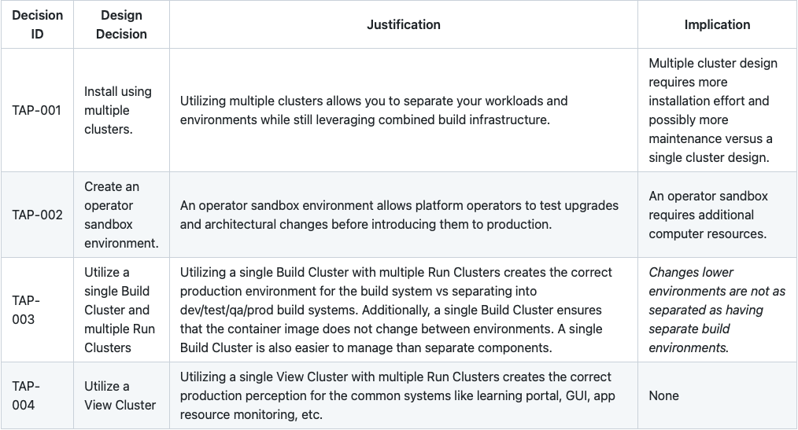

For production deployments, VMware recommends two fully independent instances of Tanzu Application Platform. One instance for operators to conduct their own reliability tests, and the other instance hosts development, test, QA and production environments isolated by separate clusters

