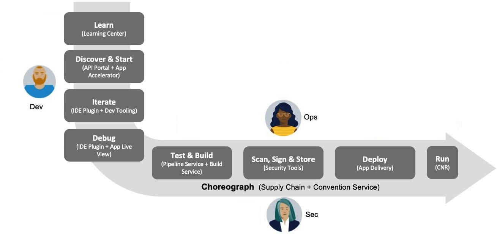
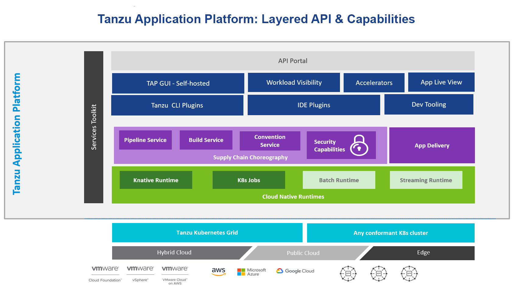

## Tanzu Application Overview
Tanzu Application Platform:

* Delivers a superior developer experience for enterprises building and deploying cloud-native applications on Kubernetes.
* Allows developers to quickly build and test applications regardless of their familiarity with Kubernetes.
* Helps application teams get to production faster by automating source-to-production pipelines.
* Clearly defines the roles of developers and operators so they can work collaboratively and integrate their efforts.

TAP provides a holistic workflow while creating Supply Chains in the inner-loop & outer-loop of Software Developement Lifecycle Phase to simplify DevX experience

# Inner loop

* The inner loop describes a developer’s development cycle of iterating on code
* Inner loop activities include coding, testing, and debugging before making a commit
* Developers in the inner loop often build container images and connect their apps to all necessary services and APIs

# Outer loop

* Describes how operators deploy apps to production and maintain them over time
* Includes building container images, adding security, and creating CI/CD pipelines
* App delivery platforms are constructed from various third-party and open source components with numerous configuration options

Together Inner loop & Outer loop are choreographed over Supply Chains to create an ideal path to production for deploying microservices

 